# Python 基础入门


## 1. 计算机组成原理


<font size="5rem">什么是计算机？</font>

计算机（computer）俗称电脑，是现代一种用于 ==高速计算的电子机器==，可以进行数值计算，又可以进行逻辑判断，还具有存储记忆功能，且能够按程序的允许，自动、高速处理数据。通俗的说就是一个 ==存储和计算数据的== 电子设备

> 计算机是20世纪最先进的科学技术发明之一


<font size="5rem">计算机是由什么组成的？</font>

一个完整的计算机系统，是由 `硬件系统` 和 `软件系统` 两大部分组成的

~~~mermaid
flowchart TD
    A("硬件系统"):::someclass --- B("主机部分"):::sameclass
          
    C --- G("运算器"):::someclass
    C --- H("控制器"):::someclass
    
    B --- C("中央处理器CPU"):::sameclass
    B --- D("内存储器"):::sameclass
    
    D --- E("随机存储器"):::someclass
    D --- F("只读存储器"):::someclass
    
    A --- I("外设部分"):::sameclass
    
    I --- J("输入设备"):::sameclass
    J --- M("键盘、鼠标、摄像头等"):::someclass
    
    I --- K("输出设备"):::sameclass
    K --- N("显示器、音箱、打印机等"):::someclass
        
    I --- L("外存储器"):::sameclass
    L --- O("软盘、硬盘、U盘等"):::someclass
        
    classDef someclass fill:#cddffd, stroke:#000;
    classDef sameclass fill:#fcf3ea, stroke:#000;
~~~

~~~mermaid
flowchart TD
	a("软件系统"):::someclass --- b("系统软件"):::sameclass
    a --- c("应用软件"):::sameclass
    
    b --- d("操作系统"):::someclass
    b --- e("驱动程序"):::someclass
    b --- f("语言处理程序"):::someclass
    b --- g("数据库管理系统等"):::someclass
    
    c --- h("浏览器"):::someclass
    c --- i("文本编辑器"):::someclass
    c --- j("音视频播放器等"):::someclass
    
    classDef someclass fill:#cddffd, stroke:#000;
    classDef sameclass fill:#fcf3ea, stroke:#000;
~~~


<font size="5rem">1. 硬件系统</font>

主要分为主机和外设两部分，是指哪些构成计算机系统的物理实体，它们主要由各种各样的电子器件和机电装置组成

从ENIAC（世界上第一台计算机）到当前最先进的计算机，硬件系统的设计采用的都是 **冯·诺依曼体系结构**

 

> 运算器：负责数据的算术运算和逻辑运算，即数据的加工处理
>
> 控制器：是整个计算机的中枢神经，分析程序规定的控制信息，并根据程序要求进行控制，协调计算机各部分组件工作及内存与外设的访问等
>
> > 运算器和控制器统称为中央处理器（即CPU）
>
> 存储器：实现记忆功能的部件，用来存储程序、数据和各种信号、命令等信息，并在需要时提供这些信息
>
> 输入设备：实现将程序、原始数据、文字、字符、控制命令或现场采集的数据等信息输入到计算机
>
> 输出设备：实现将计算机处理后生成的中间结果或最后结果（各种数据符号及文字或各种控制信号等信息）输出出来


<font size="5rem">2. 软件系统</font>

主要分为系统软件和应用软件，是指计算机证运行所需的各种各样的计算机程序

系统软件的任务是既要保证计算机硬件的正常工作，又要使计算机硬件的性能得到充分发挥，并且为计算机用户提供一个比较直观、方便和友好的使用界面

**操作系统：**是一种方便用户管理和控制计算机软硬件资源的系统软件，同时也是一个大型的软件系统，其功能复杂，体系庞大，在整个计算机系统中具有承上启下的地位·我们操作计算机实际上是通过操作系统来进行的，它是所有软件的基础和核心

**语言处理程序：**也称为编译程序，作用是把程序员用某种编程语言（如Python）所编写的程序，翻译成计算机可执行的机器语言。机器语言也被称为机器码，是可以通过CPU进行分析和执行的指令集

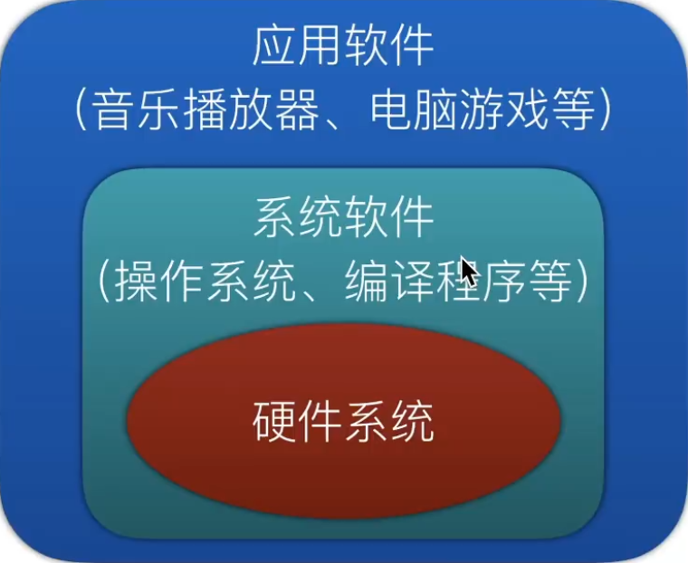 


<font size="5rem">3. 计算机是如何处理程序的？</font>

按照冯·诺依曼存储程序的原理，计算机的工作流程大致如下：

1. 用户打开程序，程序开始执行

2. 操作系统将序内容和相关数据送入计算机的内存

3. CPU根据程序内容从内存中读取指令

4. CPU分析、处理指令，并为取下一条指令做准备

5. 取下一条指令并分析、处理，如此重复操作，直至执行完程序中全部指令，最后将计算的结果放入指令指定的存储器地址中

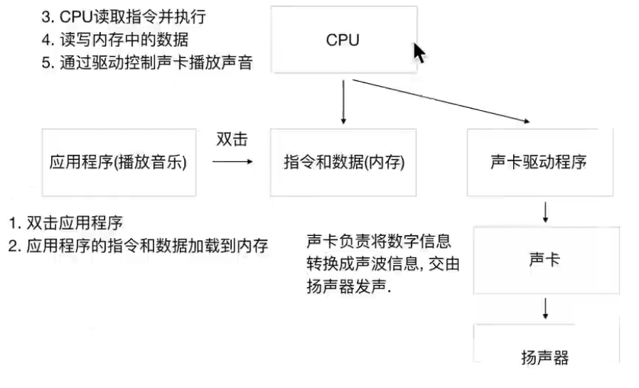 

> 总结：==计算机想要运行应用程序，需要将软件加载到内存中，CPU只能和内存进行交互==


### 1.1 编程语言和Python


**计算机不能直接理解任何除机器语言以外的语言**，所以必须要把程序员缩写的程序语言翻译成机器语言，计算机才能执行程序。**将其他语言翻译成机器语言的工具，被称为编译器**

编译器翻译的方式有两种：一个是**编译**，另外一个是**解释**。两种方式之间的区别在于**翻译时间点的不同**。当编译器**以解释方式运行的时候**，也称之为**解释器**

 

* **编译型语言**：程序在执行之前需要一个专门的编译过程，把程序编译成为机器语言的文件，运行时不需要重新翻译，直接使用编译的结果就行了。程序执行效率高，依赖编译器，跨平台性差些。如 C、C++
* **解释型语言**：解释型语言编写的程序不进行预先编译，以文本方式存储程序代码，会将代码一句一句直接运行。在发布程序时，看起来省了道编译工序，但是在运行程序的时候，必须先解释再运行


#### 1.1.1 编译型语言和解释型语言对比

* **速度** —— 编译型语言比解释型语言执行速度快
* **跨平台性** —— 解释型语言比编译型语言跨平台性好


#### 1.1.2 Python 程序执行原理


1. 操作系统会首先让 **CPU** 把 **Python 解释器** 的程序复制到 **内存** 中
2. **Python 解释器** 根据语法规则，**从上向下** 让 **CPU** 翻译 **Python 程序中的代码**
3. **CPU** 负责执行翻译完成的代码


<font size="5rem">Python 的解释器到底有多大？</font>

在Linux下执行以下终端命令即可查看 Python 解释器的实际大小

~~~bash
# 确认解释器所在的位置
sarex@sarex-PC:~$ which python
/usr/bin/python

# 查看 Python 文件大小（只是一个软链接）
sarex@sarex-PC:~$ ls -lh /usr/bin/python
lrwxrwxrwx 1 root root 7  3月  3  2021 /usr/bin/python -> python3
sarex@sarex-PC:~$ ls -lh /usr/bin/python3
lrwxrwxrwx 1 root root 9  4月  5  2021 /usr/bin/python3 -> python3.9

# 查看具体文件的大小
sarex@sarex-PC:~$ ls -lh /usr/bin/python3.9
-rwxr-xr-x 1 root root 5.3M  3月  1  2021 /usr/bin/python3.9
~~~

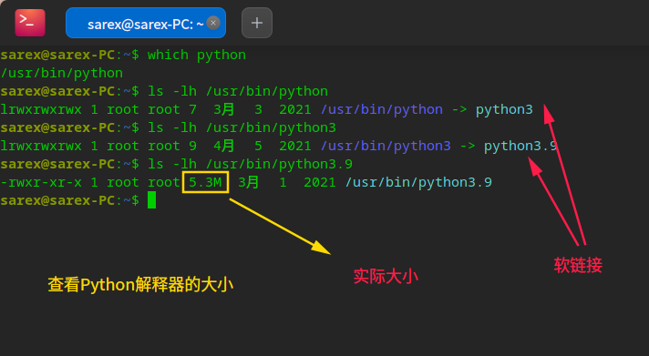 

> 提示：建立 **软链接** 的目的，是为了方便使用者不用记住使用的解释器是 **哪一个具体版本**


### 1.2 Python 的设计目标


1999 年，吉多·范罗苏姆向 DARPA 提交了一条名为 “Computer Programming for Everybody” 的资金申请，并在后来说明了他对 Python 的目标：

* 一门**简单直观的语言**并与主要竞争者一样强大
* **开源**，以便任何人都可以为它做贡献
* 代码**像纯英语那样容易理解**
* 适用于**短期**开发的日常任务

这些想法中的基本都已经成为现实，Python 已经成为一门流行的编程语言


<font size="5rem" color="Orange">设计哲学：</font>

1. 优雅
2. 明确
3. 简单

+ Python 开发者的哲学是：**用一种方法，最好是只有一种方法来做一件事**
+ 如果面临多种选择，Python 开发者一般会拒绝花哨的语法，而选择**明确没有或者很少有歧义的语法**


### 1.3 Python 的特点


* Python 是**完全面向对象的语言**
  * **函数**、**模块**、**数字**、**字符串**都是对象，**在 Python 中一切皆对象**
  * 完全支持继承、重载、多重继承
  * 支持重载运算符，也支持泛型设计
* Python **拥有一个强大的标准库**，Python 语言的核心只包含 **数字**、**字符串**、**列表**、**字典**、**文件** 等常见类型和函数，而由 Python 标准库提供了 **系统管理**、**网络通信**、**文本处理**、**数据库接口**、**图形系统**、**XML 处理** 等额外的功能
* Python 社区提供了**大量的第三方模块**，使用方式与标准库类似。它们的功能覆盖 **科学计算**、**人工智能**、**机器学习**、**Web 开发**、**数据库接口**、**图形系统** 多个领域


#### 面向对象的思维方式

* **面向对象** 是一种 **思维方式**，也是一门 **程序设计技术**
* 要解决一个问题前，首先考虑 **由谁** 来做，怎么做事情是 **谁** 的职责，最后把事情做好就行！
  * **对象** 就是 **谁**
* 要解决复杂的问题，就可以找**多个不同的对象**，**各司其职**，共同实现，最终完成需求


### 1.4 Python 的优缺点


#### 4.1 优点

* 简单、易学
* 免费、开源
* **面向对象**
* 丰富的库
* 可扩展性
  * 如果需要一段关键代码运行得更快或者希望某些算法不公开，可以把这部分程序用 `C` 或 `C++` 编写，然后在 `Python` 程序中使用它们
* ……


#### 4.2 缺点

* 运行速度
* 国内市场较小
* 中文资料匮乏


## 2. 第一个 HelloWorld 程序


### 2.1 Python 源程序的基本概念

1. Python 源程序就是一个 **特殊格式的文本文件，可以使用任意文本编辑软件做** Python 的开发
2. Python 程序的 **文件扩展名通常是 `.py`**


### 2.2 新建项目

#### 1) 命名规则

* 以后 **项目名** 前面都以 **数字编号**，**随着知识点递增，编号递增**
  * 例如：**01_Python 基础**、**02_分支**、**03_循环**...
* 每个项目下的 **文件名** 都以 `hm_xx_知识点` 方式来命名
  * 其中 **xx** 是演练文件的序号

* 注意
  * 1. 命名文件名时建议只使用 **小写字母**、**数字** 和 **下划线**
  * 2. **文件名不能以数字开始**

* 通过 **欢迎界面** 或者菜单 **File** / **New Project** 可以新建项目


## 3. 注释

> 使用用自己熟悉的语言，在程序中对某些代码进行标注说明，增强程序的可读性


### 3.1 行注释

以 `#` 开头，`#` 右边的所有东西都被当做说明文字，而不是真正要执行的程序，只起到辅助说明作用

示例代码如下：

~~~python
# 这是第一个单行注释
print("hello Python")
~~~

> 为了保证代码的可读性，`#` 后面建议先添加一个空格，然后再编写相应的说明文字


<font size="5rem">在代码后面增加的单行注释</font>

1. 在程序开发时，同样可以使用 `#` 在代码的后面（旁边）增加说明性文字

2. 但是，需要注意的是，**为了保证代码的可读性，注释和代码之间** 至少要有 **两个空格**

   + 示例代码如下：

     ~~~python
     print("hello python")  # 输出 `hello python`
     ~~~

     

     可以看到，当执行完第二行的代码时，解释器直接 **越过**第五行，执行输出第六行

     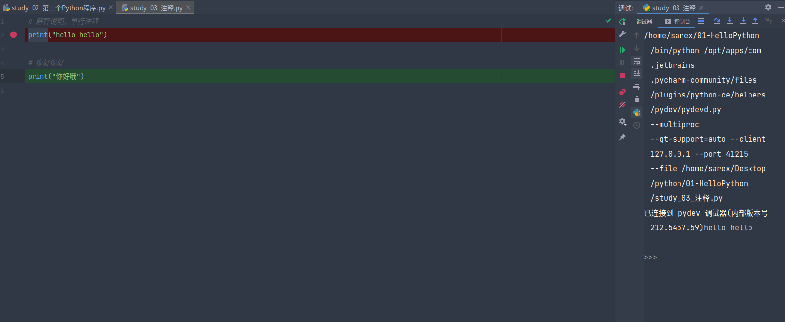


### 3.2 多行注释（块注释）

* 如果希望编写的 **注释信息很多，一行无法显示**，就可以使用多行注释
* 要在 Python 程序中使用多行注释，可以用 **一对 连续的 三个 引号**(单引号和双引号都可以)

* 示例代码如下：

```python
"""
这是一个多行注释

在多行注释之间，可以写很多很多的内容……
""" 
print("hello python")
```


<font size="5rem">什么时候需要使用注释？</font>

1. **注释不是越多越好**，对于一目了然的代码，不需要添加注释
2. 对于 **复杂的操作**，应该在操作开始前写上若干行注释
3. 对于 **不是一目了然的代码**，应在其行尾添加注释（为了提高可读性，注释应该至少离开代码 2 个空格）
4. 绝不要描述代码，假设阅读代码的人比你更懂 Python，他只是不知道你的代码要做什么

> 在一些正规的开发团队，通常会有 **代码审核** 的惯例，就是一个团队中彼此阅读对方的代码


#### 关于代码规范

* `Python` 官方提供有一系列 PEP（Python Enhancement Proposals） 文档
* 其中第 8 篇文档专门针对 **Python 的代码格式** 给出了建议，也就是俗称的 **PEP 8**
* 文档地址：https://www.python.org/dev/peps/pep-0008/
* 谷歌有对应的中文文档：http://zh-google-styleguide.readthedocs.io/en/latest/google-python-styleguide/python_style_rules/

> 任何语言的程序员，编写出符合规范的代码，是开始程序生涯的第一步


## 4. 算数运算符

* 算数运算符是 **运算符的一种**
* 是完成基本的算术运算使用的符号，用来处理四则运算

| 运算符 |  描述  | 实例                                       |
| :----: | :----: | ------------------------------------------ |
|   +    |   加   | 10 + 20 = 30                               |
|   -    |   减   | 10 - 20 = -10                              |
|   *    |   乘   | 10 * 20 = 200                              |
|   /    |   除   | 10 / 20 = 0.5                              |
|   //   | 取整除 | 返回除法的整数部分（商） 9 // 2 输出结果 4 |
|   %    | 取余数 | 返回除法的余数 9 % 2 = 1                   |
|   **   |   幂   | 又称次方、乘方，2 ** 3 = 8                 |

* 在 Python 中 `*` 运算符还可以用于字符串，计算结果就是字符串重复指定次数的结果

~~~python
# 意思就是 字符 “-” 拼接50个
In [1]: "-" * 50
Out[1]: '----------------------------------------' 
~~~

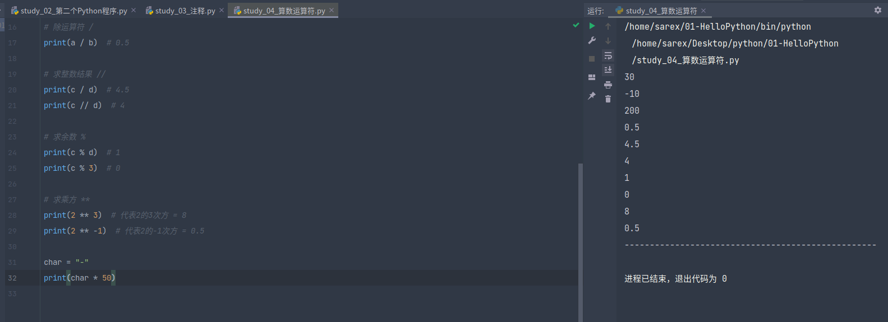


### 4.1 算数运算符的优先级

* 和数学中的运算符的优先级一致，在 Python 中进行数学计算时，同样也是：
  * **先乘除后加减**
  * 同级运算符是 **从左至右** 计算
  * 可以使用 `()` 调整计算的优先级

* 以下表格的算数优先级由高到最低顺序排列

| 运算符   | 描述                   |
| -------- | ---------------------- |
| **       | 幂 (最高优先级)        |
| * / % // | 乘、除、取余数、取整除 |
| + -      | 加法、减法             |

* 例如：
  * `2 + 3 * 5 = 17`
  * `(2 + 3) * 5 = 25`
  * `2 * 3 + 5 = 11`
  * `2 * (3 + 5) = 16`

~~~python
# 定义变量
a: int = 10
b: int = 20
c: int = 9
d: int = 2

# 加运算符 +
print(a + b)  # 30

# 减运算符 -
print(a - b)  # -10

# 乘运算符 *
print(a * b)  # 200

# 除运算符 /
print(a / b)  # 0.5

# 求整数结果 //
print(c / d)  # 4.5
print(c // d)  # 4

# 求余数 %
print(c % d)  # 1
print(c % 3)  # 0

# 求乘方 **
print(2 ** 3)  # 代表2的3次方 = 8
print(2 ** -1)  # 代表2的-1次方 = 0.5

char = "-"
print(char * 50)

print(2 + 3 * 5)  # 17 = 3*5 = 15 + 2 = 17,先乘除，后加减

# 若想提升优先级运算，则需要添加（）
print((2 + 3) * 5)  # 预测=25，先2+3，后5*5 = 25
~~~


## 5. 变量的基本使用


### 5.1 变量定义

* 在 Python 中，每个变量 **在使用前都必须赋值**，变量 **赋值以后** 该变量 **才会被创建**
* 等号（=）用来给变量赋值
  * `=` 左边是一个变量名
  * `=` 右边是存储在变量中的值

```python
变量名 = 值
```

> 变量定义之后，后续就可以直接使用了


示例代码：

~~~python
# 定义 qq_number 的变量来保存 QQ号码
qq_number = "1234567"
print(qq_number)

# 定义 qq_password 的变量来保存 QQ密码
qq_password = "1234567"
print(qq_password)
~~~


#### 5.1.1 案例联系——超市买苹果

+ 可以用 其他变量的计算结果 来定义变量
+ 变量定义之后，后续就可以直接使用了


需求

+ 苹果的价格是 8.5元/斤
+ 买了 7.5 斤 的苹果
+ 计算付款金额


示例：

~~~python
"""
需求： 苹果的价格是 8.5 元/斤
      买了 7.5 斤 苹果，计算应付金额
"""
apple = 8.5
weight = 7.5

money = apple * weight
print("应付：", money, '元')
~~~


升级：如果只要买了苹果，就返5块钱

计算购买的金额

~~~python
"""
需求： 苹果的价格是 8.5 元/斤
      买了 7.5 斤 苹果，计算应付金额
"""
apple = 8.5
weight = 7.5

money = apple * weight
print("应付：", money, '元')  # 63.75

money -= 5
print("返利后：", money, '元')  # 58.75
~~~

**提问**

* 上述代码中，一共定义有几个变量？
  * 三个：`price`／`weight`／`money`
* `money = money - 5` 是在定义新的变量还是在使用变量？
  * 直接使用之前已经定义的变量
  * 变量名 只有在 **第一次出现** 才是 **定义变量**
  * 变量名 再次出现，不是定义变量，而是直接使用之前定义过的变量
* 在程序开发中，可以修改之前定义变量中保存的值吗？
  * 可以
  * 变量中存储的值，就是可以 **变** 的


### 5.2 变量的类型


此案例涉及到的数据类型：

* `str` —— 字符串
* `bool` —— 布尔（真假）
* `int` —— 整数
* `float` —— 浮点数（小数）

~~~python
"""
需求：定义变量保存小明的个人信息
PS：在Python中不需要指明变量的数据类型，Python可以根据等号右侧的值自动判断数值类型
"""
name = "小明"
age = 18
sex = True  # 是男生 bool True/False
height = 1.75
weight = 75.0
if sex:
    sex = '男'
else:
    sex = '女'
print("姓名：", name, "年龄：", age, "性别：", sex, "身高：", height, "体重：", weight)
~~~

在 `Python` 中定义变量时需要指定类型吗？

* 不需要
* `Python` 可以根据 `=` 等号右侧的值，自动推导出变量中存储数据的类型

> 在函数中，如何查看变量的类型？
>
> + 使用 `type(X)` 函数可以快速查看当前变量的类型


### 5.3 变量的类型

* 在 `Python` 中定义变量是 **不需要指定类型**（在其他很多高级语言中都需要）
* 数据类型可以分为 **数字型** 和 **非数字型**
* 数字型
  * 整型 (`int`)
  * 浮点型（`float`）
  * 布尔型（`bool`） 
    * 真 `True` `非 0 数` —— **非零即真**
    * 假 `False` `0`
  * 复数型 (`complex`)
    * 主要用于科学计算，例如：平面场问题、波动问题、电感电容等问题
* 非数字型
  * 字符串
  * 列表
  * 元组
  * 字典

> 提示：在 Python 2.x 中，**整数** 根据保存数值的长度还分为：
>
>   * `int`（整数）
>   * `long`（长整数）


### 5.4 不同类型变量之间的计算


<font size = "5rem">1.数字型变量之间的计算</font>

* 在 Python 中，两个数字型变量是可以直接进行 算数运算的
* 如果变量是 `bool` 型，在计算时
  * `True` 对应的数字是 `1`
  * `False` 对应的数字是 `0`

示例：

~~~python
i = 10
f = 10.5
b = True

# 测试
print(i + f)  # 20.5
print(i + b)  # 11
~~~


<font size="5rem">2.字符串变量之间使用 "+" 拼接字符串</font>

1. 在 Python 中，字符串之间可以使用 `+` 拼接生成新的字符串

示例：

~~~Python
first_name = "张"
last_name = "三"
print(first_name + last_name)  # 张三
~~~


2. 在 Python 中，字符串变量可以和整数使用 `*` 重复拼接相同的字符串

~~~python
first_name = "张"
last_name = "三"
print(first_name + last_name)  # 张三
print("=" * 10)  # ==========

# 试图使用 int类型 与 str类型做 算术运算
# temp = first_name + 10
# print(temp)  # 报错，显示TypeError: can only concatenate str (not "int") to str
temp = first_name + "10"
print(temp)  # 张10
~~~


### 5.5 变量的输入


就是用代码获取用户通过键盘输入的信息

在 Python 中，如果要获取用户在 **键盘** 上的输入信息，需要使用到 `input` 函数


#### 5.1.1 关于函数

* 一个 **提前准备好的功能**(别人或者自己写的代码)，**可以直接使用**，而 **不用关心内部的细节**

| 函数     | 说明              |
| -------- | ----------------- |
| print(x) | 将 x 输出到控制台 |
| type(x)  | 查看 x 的变量类型 |


#### 5.1.2 input 函数实现键盘输入

* 在 Python 中可以使用 `input` 函数从键盘等待用户的输入
* 用户输入的 **任何内容** Python 都认为是一个 ==**字符串**==
* 语法如下：

~~~python
字符串变量 = input("提示信息：")
~~~


在终端中先输入 Python，进入Python交互式编程

~~~python
sarex@sarex-PC:~$ python
Python 3.9.2 (default, Feb 28 2021, 17:03:44) 
[GCC 10.2.1 20210110] on linux
Type "help", "copyright", "credits" or "license" for more information.
>>> input()
123
'123'
>>> password = input("请输入银行密码：")
请输入银行密码：123456
>>> password
'123456'
>>> print(password)
123456
~~~


+ 验证 使用`input()` 函数输入的内容都是 ==字符串类型==

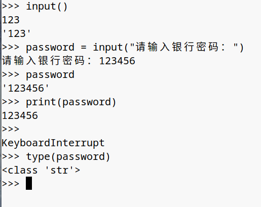 


### 5.6 类型转换函数


| 函数     | 说明                  |
| -------- | --------------------- |
| int(x)   | 将 x 转换为一个整数   |
| float(x) | 将 x 转换到一个浮点数 |


示例：

~~~python
# 字符串类型 -> 整型
>>> int("123")
123
>>> type(int("123"))
<class 'int'>

# 字符串类型 -> 浮点型
>>> float("12.3")
12.3
>>> type(float("12.3"))
<class 'float'>

# 没有单引号输出的，说明不是字符串类型
~~~


<font size="5rem" color="orange">案例练习：超市买苹果Plus</font>

需求：

1. 收银员输入 苹果的价格，单位：元/斤
2. 收银员输入 用户购买苹果的重量，单位：斤
3. 计算并且 输出 付款金额


示例：

~~~python
# 修改前
"""
price_str = input("请输入苹果的价格：")
weight_str = input("请输入苹果的重量：")
显示TypeError: can't multply sequence by non-int of type 'str'
"""

# 写法1
price_str = float(input("请输入苹果的价格："))
weight_str = float(input("请输入苹果的重量："))

money = price_str * weight_str
print("您应付款：", money, "元")

# 写法2
price = float(price_str)
weight = float(weight_str)
money = price * weight
print("您应付款：", money, "元")
~~~


### 5.7 变量的格式化输出


> 苹果单价 `9.00` 元/斤，购买了 `5.00` 斤，需要支付 `45.00` 元

+ 在 Python 中可以使用 print 函数将信息输出到控制台
+ 如果希望输出文字信息的同时，一起输出数据，就需要用到 格式化操作符
+ `%` 称为格式化操作符，专门用于处理字符串中的格式
  + 包含 `%` 的字符串，被称为 格式化字符串
  + `%` 和不同的字符连用，不同类型的数据需要使用不同的格式化字符

| 格式化字符 | 含义                                                         |
| ---------- | ------------------------------------------------------------ |
| %s         | 字符串                                                       |
| %d         | 有符号十进制整数，`%06d` 表示输出的整数显示位数，不足的地方使用 `0` 补全 |
| %f         | 浮点数，`%.2f` 表示小数点后只显示两位                        |
| %%         | 输出 `%`                                                     |


示例：

~~~python
print("格式化字符串" % 变量1)
print("格式化字符串" % (变量1, 变量2...))
~~~

> 多个变量需要格式化时，需要 % (变量1，变量2，变量3 ...)


案例练习：

1. 定义字符串变量 `name`，输出 **我的名字叫 小明，请多多关照！**
2. 定义整数变量 `student_no`，输出 **我的学号是 000001**
3. 定义小数 `price`、`weight`、`money`，输出 **苹果单价 9.00 元／斤，购买了 5.00 斤，需要支付 45.00 元**
4. 定义一个小数 `scale`，输出 **数据比例是 10.00%**


示例：

~~~python
# 定义字符串变量 `name`，输出 我的名字叫 小明，请多多关照！
name = input("请输入名字：")
print("我的名字叫 %s, 请多多关照！" % name)

# 定义整数变量 `student_no`，输出 我的学号是 000001
# %d表示符号十进制整数，`%06d` 表示输出的整数显示位数，不足的地方使用 `0` 补全
student_no = int(input("请输入你的学号："))
print("我的学号是：%06d" % student_no)
# 比如 %06d 就是代表有6位数字，如果没到就使用0来站位，如果超出了6位，就照常显示

# 3. 定义小数 `price`、`weight`、`money`，输出 苹果单价 9.00 元／斤，购买了 5.00 斤，需要支付 45.00 元
price = float(input("请输入苹果的价格："))
weight = float(input("请输入苹果的重量："))
money = price * weight
print("苹果单价 %.2f 元/斤，购买了 %.2f 斤，需要支付 %.2f 元" % (price, weight, money))

# 4. 定义一个小数 `scale`，输出 数据比例是 10.00%
# 我想在控制台输出25.00%
# 方法1：scale = 0.25 * 100，然后print
# 方法2：print("数据比例是 %.2f%%" % (scale * 100))
scale = 0.25
print("数据比例是 %.2f%%" % (scale * 100))  # 25.00%
print("数据比例是 %.2f%%" % scale * 100)  # 语句输出100遍
# 注意：如果不加小括号(scale * 100)的话，代表这这句话输出100遍
~~~

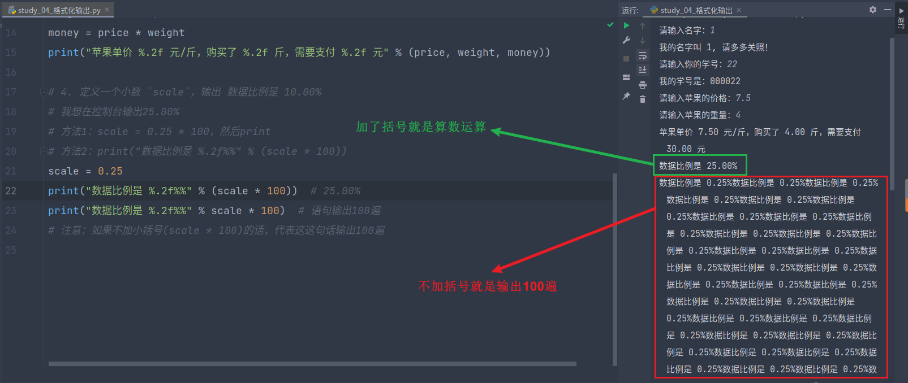


## 6. 变量的命名


### 6.1 标识符和关键字

注意点：

1. 标识符可以由 ==数字、字母、下划线组成==
2. 不能以数字开头
3. 不能与关键字重名


<font size="5rem">1.2 关键字</font>

+ 关键字 就是在 `python` 内部已经使用的标识符
+ 关键字 就是具有特殊的功能和含义
+ 开发者 不允许定义和关键字相同名字的标识符

使用 `import keyword` 查看 Python 中的关键字


示例：

~~~python
>>> import keyword
>>> print(keyword.)
keyword.iskeyword(      keyword.issoftkeyword(  keyword.kwlist          keyword.softkwlist
>>> print(keyword.kwlist)
['False', 'None', 'True', '__peg_parser__', 'and', 'as', 'assert', 'async', 'await', 'break', 'class', 'continue', 'def', 'del', 'elif', 'else', 'except', 'finally', 'for', 'from', 'global', 'if', 'import', 'in', 'is', 'lambda', 'nonlocal', 'not', 'or', 'pass', 'raise', 'return', 'try', 'while', 'with', 'yield']
~~~

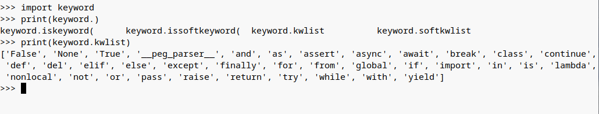


### 6.2 变量的命名规则


1. 在 Python 中，如果变量名需要由 两个或多个单词组成时，可以按以下方式命名
   + 每个单词都使用小写字母
   + 单词与单词之间使用 下划线_ 连接
   + 例如：`first_name`、`last_name`、`qq_number`、`qq_password`


2. 驼峰命名法

* 当 **变量名** 是由二个或多个单词组成时，还可以利用驼峰命名法来命名
* **小驼峰式命名法**
  * 第一个单词以小写字母开始，后续单词的首字母大写
  * 例如：`firstName`、`lastName`
* **大驼峰式命名法**
  * 每一个单词的首字母都采用大写字母
  * 例如：`FirstName`、`LastName`、`CamelCase` 


## 7. if 语句


在 `Python` 中，**if 语句** 就是用来进行判断的，格式如下：

```python
if 要判断的条件:
    条件成立时，要做的事情
    ……
```

> 注意：代码的缩进为一个 `tab` 键，或者 **4** 个空格 —— **建议使用空格**
>
> * 在 Python 开发中，Tab 和空格不要混用！

**我们可以把整个 if 语句看成一个完整的代码块**

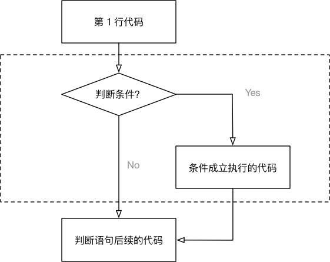


<font size="5rem">案例练习</font>


**需求**

1. 定义一个整数变量记录年龄
2. 判断是否满 18 岁 （**>=**）
3. 如果满 18 岁，允许进网吧嗨皮

```python
# 1. 定义年龄变量
age = 18

# 2. 判断是否满 18 岁
# if 语句以及缩进部分的代码是一个完整的代码块
if age >= 18:
    print("可以进网吧嗨皮……")

# 3. 思考！- 无论条件是否满足都会执行
print("这句代码什么时候执行?")
```

**注意**：

* `if` 语句以及缩进部分是一个 **完整的代码块**


<font size="5rem">else 处理条件不满足的情况</font>


**思考**

在使用 `if` 判断时，只能做到满足条件时要做的事情。那如果需要在 **不满足条件的时候**，做某些事情，该如何做呢？

**答案**

`else`，格式如下：

```python
if 要判断的条件:
    条件成立时，要做的事情
    ……
else:
    条件不成立时，要做的事情
    ……
```

**注意**：

* `if` 和 `else` 语句以及各自的缩进部分共同是一个 **完整的代码块**


改进年龄：

~~~python
# 定义一个整数变量记录年龄
age = int(input("请输入你的年龄："))
if age >= 18:
    print("允许进入网吧")
else:
    print("未成年，不允许进入网吧")
~~~


## 8. 逻辑运算

* 在程序开发中，通常 **在判断条件时**，会需要同时判断多个条件
* 只有多个条件都满足，才能够执行后续代码，这个时候需要使用到 **逻辑运算符**
* **逻辑运算符** 可以把 **多个条件** 按照 **逻辑** 进行 **连接**，变成 **更复杂的条件**
* Python 中的 **逻辑运算符** 包括：**与 and**／**或 or**／**非 not** 三种

### 8.1 `and`

```
条件1 and 条件2
```

* **与**／**并且**
* 两个条件同时满足，返回 `True`
* 只要有一个不满足，就返回 `False`

| 条件 1 | 条件 2 |  结果  |
| :----: | :----: | :----: |
|  成立  |  成立  |  成立  |
|  成立  | 不成立 | 不成立 |
| 不成立 |  成立  | 不成立 |
| 不成立 | 不成立 | 不成立 |

### 8.2 `or`

```
条件1 or 条件2
```

* **或**／**或者**
* 两个条件只要有一个满足，返回 `True`
* 两个条件都不满足，返回 `False`

| 条件 1 | 条件 2 |  结果  |
| :----: | :----: | :----: |
|  成立  |  成立  |  成立  |
|  成立  | 不成立 |  成立  |
| 不成立 |  成立  |  成立  |
| 不成立 | 不成立 | 不成立 |

### 8.3 `not`

```
not 条件
```

* **非**／**不是**

|  条件  |  结果  |
| :----: | :----: |
|  成立  | 不成立 |
| 不成立 |  成立  |

#### 逻辑运算演练

1. 练习1: 定义一个整数变量 `age`，编写代码判断年龄是否正确
   * 要求人的年龄在 0-120 之间
2. 练习2: 定义两个整数变量 `python_score`、`c_score`，编写代码判断成绩
   * 要求只要有一门成绩 > 60 分就算合格
3. 练习3: 定义一个布尔型变量 `is_employee`，编写代码判断是否是本公司员工
   * 如果不是提示不允许入内

~~~python
# 1. 练习1: 定义一个整数变量 `age`，编写代码判断年龄是否正确
#    要求人的年龄在 0-120 之间
age = int(input("请输入年龄："))
if age > 0 and age < 120:
    print(age)
else:
    print("请重新输入年龄")

# 2. 练习2: 定义两个整数变量 `python_score`、`c_score`，编写代码判断成绩
#    要求只要有一门成绩 > 60 分就算合格
python_score = int(input("请输入成绩1："))
c_score = int(input("请输入成绩2："))
if python_score > 60 or c_score > 60:
    print("合格！")
else:
    print("不合格！")

# 3. 练习3: 定义一个布尔型变量 `is_employee`，编写代码判断是否是本公司员工
#    如果不是提示不允许入内
is_employee = True
if not is_employee:
    print("不允许入内！")
else:
    print("欢迎！")
~~~


### 8.4 `elif`

* 在开发中，使用 `if` 可以 **判断条件**
* 使用 `else` 可以处理 **条件不成立** 的情况
* 但是，如果希望 **再增加一些条件**，**条件不同，需要执行的代码也不同** 时，就可以使用 `elif` 
* 语法格式如下：

```python
if 条件1:
    条件1满足执行的代码
    ……
elif 条件2:
    条件2满足时，执行的代码
    ……
elif 条件3:
    条件3满足时，执行的代码
    ……
else:
    以上条件都不满足时，执行的代码
    ……
```

* 对比逻辑运算符的代码

```python
if 条件1 and 条件2:
    条件1满足 并且 条件2满足 执行的代码
    ……
```

**注意**

1. `elif` 和 `else` 都必须和 `if` 联合使用，而不能单独使用
2. 可以将 `if`、`elif` 和 `else` 以及各自缩进的代码，看成一个 **完整的代码块**


#### elif 演练 —— 女友的节日

**需求**

1. 定义 `holiday_name` 字符串变量记录节日名称
2. 如果是 **情人节** 应该 **买玫瑰**／**看电影**
3. 如果是 **平安夜** 应该 **买苹果**／**吃大餐**
4. 如果是 **生日** 应该 **买蛋糕**
5. 其他的日子每天都是节日啊……


示例：

~~~python
# 需求
# 1. 定义 `holiday_name` 字符串变量记录节日名称
holiday_name = input("请输入节日：")

# 2. 如果是 **情人节** 应该 **买玫瑰**／**看电影**
if holiday_name == "情人节":
    print("买玫瑰，看电影")

# 3. 如果是 **平安夜** 应该 **买苹果**／**吃大餐**
elif holiday_name == "平安夜":
    print("买苹果，吃大餐")

# 4. 如果是 **生日** 应该 **买蛋糕**
elif holiday_name == "生日":
    print("买蛋糕")

# 5. 其他的日子每天都是节日啊……
else:
    print("其他日子都是节日")
~~~


### 8.5 if 语句的嵌套


> **elif** 的应用场景是：**同时** 判断 **多个条件**，所有的条件是 **平级** 的

* 在开发中，使用 `if` 进行条件判断，如果希望 **在条件成立的执行语句中** 再 **增加条件判断**，就可以使用 **if 的嵌套**
* **if 的嵌套** 的应用场景就是：**在之前条件满足的前提下，再增加额外的判断**
* **if 的嵌套** 的语法格式，**除了缩进之外** 和之前的没有区别
* 语法格式如下：

~~~python
if 条件 1:
    条件 1 满足执行的代码
    ……
    if 条件 1 基础上的条件 2:
       条件 2 满足时，执行的代码
       ……
    # 条件 2 不满足的处理
    else:
        条件 2 不满足时，执行的代码

# 条件 1 不满足的处理
else:
    条件1 不满足时，执行的代码
    ……
~~~


<font size="5rem">案例练习—if 语句的嵌套</font>

**需求**

1. 定义布尔型变量 `has_ticket` 表示是否有车票
2. 定义整型变量 `knife_length` 表示刀的长度，单位：厘米
3. 首先检查是否有车票，如果有，才允许进行 **安检**
4. 安检时，需要检查刀的长度，判断是否超过 20 厘米
   * 如果超过 20 厘米，提示刀的长度，不允许上车
   * 如果不超过 20 厘米，安检通过
5. 如果没有车票，不允许进门


示例：

~~~python
# 1. 定义布尔型变量 `has_ticket` 表示是否有车票
has_ticket = input("是否有车票？")

# 3. 首先检查是否有车票，如果有，才允许进行 **安检**
if has_ticket == "yes":
    # 2. 定义整型变量 `knife_length` 表示刀的长度，单位：厘米
    knife_length = float(input("刀的长度："))

    # 4. 安检时，需要检查刀的长度，判断是否超过 20 厘米
    #    * 如果超过 20 厘米，提示刀的长度，不允许上车
    if knife_length > 20:
        print("刀的长度为 %.2f cm，不允许上车" % knife_length)
    #    * 如果不超过 20 厘米，安检通过
    else:
        print("安检通过")

# 5. 如果没有车票，不允许进门
else:
    print("没车票不能上车的啊")
~~~


### 8.6 综合应用 —— 石头剪刀布

**目标**

1. 强化 **多个条件** 的 **逻辑运算**
2. 体会 `import` 导入模块（“工具包”）的使用

**需求**

1. 从控制台输入要出的拳 —— 石头（1）／剪刀（2）／布（3）
2. 电脑 **随机** 出拳 —— 先假定电脑只会出石头，完成整体代码功能
3. 比较胜负

| 序号 |     规则     |
| :--: | :----------: |
|  1   | 石头 胜 剪刀 |
|  2   |  剪刀 胜 布  |
|  3   |  布 胜 石头  |


#### 8.6.1 基础代码实现

* 先 **假定电脑就只会出石头**，完成整体代码功能

```python
# 从控制台输入要出的拳 —— 石头（1）／剪刀（2）／布（3）
player = int(input("请出拳 石头（1）／剪刀（2）／布（3）："))

# 电脑 随机 出拳 - 假定电脑永远出石头
computer = 1

# 比较胜负
# 如果条件判断的内容太长，可以在最外侧的条件增加一对大括号
# 再在每一个条件之间，使用回车，PyCharm 可以自动增加 8 个空格
if ((player == 1 and computer == 2) or
        (player == 2 and computer == 3) or
        (player == 3 and computer == 1)):

    print("噢耶！！！电脑弱爆了！！！")
elif player == computer:
    print("心有灵犀，再来一盘！")
else:
    print("不行，我要和你决战到天亮！")

```


自己尝试的：

~~~python
import random

# 定义循环变量
i = 1

# 定义电脑猜拳
computer = random.randint(1, 3)

while i:
    player_guess = int(input("猜拳选择：1.石头 2.剪刀 3.布："))

    # 这里判断以下用户数据的合法性，以保持程序的健壮性
    while player_guess < 0 or player_guess > 3:
        print("出错了")
        player_guess = int(input("猜拳选择：1.石头 2.剪刀 3.布："))

    print("你所选择的是：%d，电脑选择的是：%d" % (player_guess, computer))

    # 先考虑玩家赢了的所有情况
    if ((player_guess == 1 and computer == 2)
            or (player_guess == 2 and computer == 3)
            or (player_guess == 3 and computer == 1)):

        print("恭喜你，你赢了！")
        break

    # 玩家和电脑平手
    elif player_guess == computer:
        print("平手，再来一次！")

    # 玩家输了的情况
    else:
        print("你输了！")
        break

"""
优化前：
    # 玩家输了的情况
    elif (player_guess == 1 and computer == 3) or (player_guess == 2 and computer == 1) or (
            player_guess == 3 and computer == 2):
        print("你输了！")
        break

    # 玩家和电脑平手
    else:
        print("平手，再来一次！")
"""
~~~


#### 8.6.2 随机数的处理

* 在 `Python` 中，要使用随机数，首先需要导入 **随机数** 的 **模块** —— “工具包”

```python
import random
```

* 导入模块后，可以直接在 **模块名称** 后面敲一个 `.` 然后按 `Tab` 键，会提示该模块中包含的所有函数

* `random.randint(a, b)` ，返回 `[a, b]` 之间的整数，包含 `a` 和 `b`
* 例如：

```python
random.randint(12, 20)  # 生成的随机数n: 12 <= n <= 20   
random.randint(20, 20)  # 结果永远是 20   
random.randint(20, 10)  # 该语句是错误的，下限必须小于上限
```


## 9. 循环

* 在程序开发中，一共有三种流程方式：

  * **顺序** —— **从上向下**，顺序执行代码
  * **分支** —— 根据条件判断，决定执行代码的 **分支**
  * **循环** —— 让 **特定代码 重复** 执行

  


### 9.1 `while` 循环基本使用

* 循环的作用就是让 **指定的代码** 重复的执行
* `while` 循环最常用的应用场景就是 **让执行的代码** 按照 **指定的次数** **重复** 执行

* 需求 —— 打印 5 遍 `Hello Python`
* 思考 —— 如果要求打印 100 遍怎么办？


#### 9.1.1 `while` 语句基本语法

```python
初始条件设置 —— 通常是重复执行的 计数器

while 条件(判断 计数器 是否达到 目标次数):
    条件满足时，做的事情1
    条件满足时，做的事情2
    条件满足时，做的事情3
    ...(省略)...
    
    处理条件(计数器 + 1)
```

**注意**：

* `while` 语句以及缩进部分是一个 **完整的代码块**
* C++里的 `i++` 是不能到`python`中使用的，建议使用 `i += 1` 或者 `i = i + 1`


<font size="5rem">第一个 while 循环</font>

**需求**

* 打印 5 遍 Hello Python

```python
# 1. 定义重复次数计数器
i = 1

# 2. 使用 while 判断条件
while i <= 5:
    # 要重复执行的代码
    print("Hello Python")

    # 处理计数器 i
    i = i + 1

print("循环结束后的 i = %d" % i)
```

> 注意：循环结束后，之前定义的计数器条件的数值是依旧存在的


+ 死循环

> 由于程序员的原因，**忘记** 在循环内部 **修改循环的判断条件**，导致循环持续执行，程序无法终止！


#### 9.1.2 赋值运算符

* 在 Python 中，使用 `=` 可以给变量赋值
* 在算术运算时，为了简化代码的编写，`Python` 还提供了一系列的 与 **算术运算符** 对应的 **赋值运算符**
* 注意：**赋值运算符中间不能使用空格**

| 运算符 | 描述                       | 实例                                  |
| ------ | -------------------------- | ------------------------------------- |
| =      | 简单的赋值运算符           | c = a + b 将 a + b 的运算结果赋值为 c |
| +=     | 加法赋值运算符             | c += a 等效于 c = c + a               |
| -=     | 减法赋值运算符             | c -= a 等效于 c = c - a               |
| *=     | 乘法赋值运算符             | c *= a 等效于 c = c * a               |
| /=     | 除法赋值运算符             | c /= a 等效于 c = c / a               |
| //=    | 取整除赋值运算符           | c //= a 等效于 c = c // a             |
| %=     | 取 **模** (余数)赋值运算符 | c %= a 等效于 c = c % a               |
| **=    | 幂赋值运算符               | c **= a 等效于 c = c ** a             |


#### 9.1.3 Python 中的计数方法

常见的计数方法有两种，可以分别称为：

* **自然计数法**（从 `1` 开始）—— 更符合人类的习惯
* **程序计数法**（从 `0` 开始）—— 几乎所有的程序语言都选择从 0 开始计数

因此，大家在编写程序时，应该尽量养成习惯：**除非需求的特殊要求，否则 循环 的计数都从 0 开始**


#### 9.1.4 循环计算

> 在程序开发中，通常会遇到 **利用循环** **重复计算** 的需求

遇到这种需求，可以：

1. 在 `while` 上方定义一个变量，用于 **存放最终计算结果**
2. 在循环体内部，每次循环都用 **最新的计算结果**，**更新** 之前定义的变量

**需求**

* 计算 0 ~ 100 之间所有数字的累计求和结果

~~~python
# 计算 0 ~ 100 之间所有数字的累计求和结果
i = 0
n = 0
Sum1 = 0
Sum2 = 0

while i <= 100:
    # 写法1：+=
    Sum1 += i
    i += 1
print("0 ~ 100之间所有数字的累计求和结果为：%d" % Sum1)  # 5050

while n <= 100:
    # 写法2：Sum = Sum + 1
    Sum2 = Sum2 + n
    n = n + 1
print("0 ~ 100之间所有数字的累计求和结果为：%d" % Sum2)  # 5050
~~~


<font size="5rem">需求进阶</font>

* 计算 0 ~ 100 之间 所有 **偶数** 的累计求和结果

开发步骤

1. 编写循环 **确认** **要计算的数字**
2. 添加 **结果** 变量，在循环内部 **处理计算结果**


示例：

~~~python
# 计算 0 ~ 100 之间 所有 偶数 的累计求和结果
# 1. 编写循环 确认 要计算的数字
i = 0
result = 0
# 2. 添加 结果 变量，在循环内部 处理计算结果
while i <= 100:
    if i % 2 == 0:
        result += i
    i += 1
print("0~100之间所有的偶数和结果为：%d" % result)

~~~


### 9.2 break 和 continue

* `break` **某一条件满足时**，退出循环，不再执行后续重复的代码
* `continue` **某一条件满足时**，不执行后续重复的代码

> `break` 和 `continue` 只针对 **当前所在循环** 有效

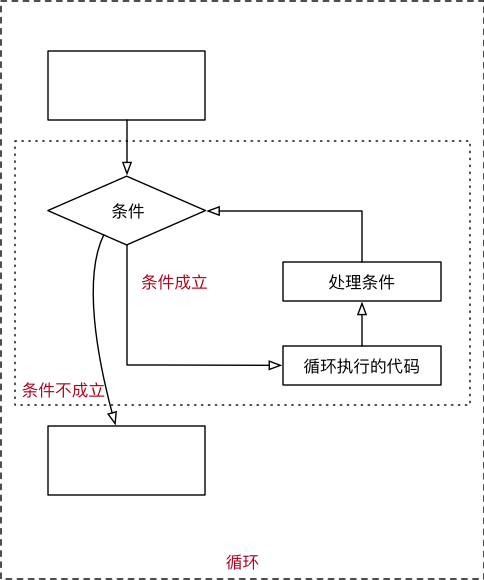 


#### 9.2.1 break

* **在循环过程中**，如果 **某一个条件满足后**，**不** 再希望 **循环继续执行**，可以使用 `break` 退出循环

```python
i = 0

while i < 10:

    # break 某一条件满足时，退出循环，不再执行后续重复的代码
    # i == 3
    if i == 3:
        break

    print(i)

    i += 1

print("over")
```

> `break` 只针对当前所在循环有效


#### 9.2.2 continue

* **在循环过程中**，如果 **某一个条件满足后**，**不** 希望 **执行循环代码，但是又不希望退出循环**，可以使用 `continue`
* 也就是：在整个循环中，**只有某些条件**，不需要执行循环代码，而其他条件都需要执行

```python
i = 0

while i < 10:

    # 当 i == 7 时，不希望执行需要重复执行的代码
    if i == 7:
        # 在使用 continue 之前，同样应该修改计数器
        # 否则会出现死循环
        i += 1

        continue

    # 重复执行的代码
    print(i)

    i += 1

```

* 需要注意：使用 `continue` 时，**条件处理部分的代码，需要特别注意**，不小心会出现 **死循环**

> `continue` 只针对当前所在循环有效


### 9.3 `while` 循环嵌套


#### 9.3.1 循环嵌套

* `while` 嵌套就是：`while` 里面还有 `while`

```python
while 条件 1:
    条件满足时，做的事情1
    条件满足时，做的事情2
    条件满足时，做的事情3
    ...(省略)...
    
    while 条件 2:
        条件满足时，做的事情1
        条件满足时，做的事情2
        条件满足时，做的事情3
        ...(省略)...
    
        处理条件 2
    
    处理条件 1
```


#### 9.3.2 循环嵌套演练 —— 九九乘法表


第 1 步：用嵌套打印小星星

**需求**

* 在控制台连续输出五行 `*`，每一行星号的数量依次递增

```
*
**
***
****
*****
```

* 使用字符串 * 打印

~~~python
# 1. 定义一个计数器变量，从数字1开始，循环会比较方便
row = 1
while row <= 5:
    print("*" * row)
    row += 1
~~~


**知识点** 对 `print` 函数的使用做一个增强

* 在默认情况下，`print` 函数输出内容之后，会自动在内容末尾增加换行
* 如果不希望末尾增加换行，可以在 `print` 函数输出内容的后面增加 `, end=""`
* 其中 `""` 中间可以指定 `print` 函数输出内容之后，继续希望显示的内容

* 语法格式如下：

~~~python
# 向控制台输出内容结束之后，不会换行
print("*", end="")

# 单纯的换行
print("")
~~~

> `end=""` 表示向控制台输出内容结束之后，不会换行

**假设** `Python` **没有提供** 字符串的 `*` 操作 **拼接字符串**

**需求**

* 在控制台连续输出五行 `*`，每一行星号的数量依次递增

~~~python
row = 1

while row <= 5:  
    # 假设 python 没有提供字符串 * 操作
    # 在循环内部，再增加一个循环，实现每一行的 星星 打印
    col = 1
    while col <= row:
        print("*", end="")
        col += 1
    
    # 每一行星号输出完成后，再增加一个换行
    print("")
    row += 1
~~~


九九乘法表的思路：

1. 定义行变量
2. 进入行循环，控制每一行的输出
   + 定义列变量
   + 进入列 循环

~~~python
# 九九乘法表
row = 0

while row < 9:
    col = 0

    while col <= row:
        print("%d * %d = %d" % (col + 1, row + 1, (col + 1) * (row + 1)), end="  ")
        col += 1

    print("")
    row += 1
~~~

**字符串中的转义字符**

* `\t` 在控制台输出一个 **制表符**，协助在输出文本时 **垂直方向** 保持对齐
* `\n` 在控制台输出一个 **换行符**

> **制表符** 的功能是在不使用表格的情况下在 **垂直方向** 按列对齐文本

| 转义字符 | 描述       |
| -------- | ---------- |
| \\\\     | 反斜杠符号 |
| \\'      | 单引号     |
| \\"      | 双引号     |
| \n       | 换行       |
| \t       | 横向制表符 |
| \r       | 回车       |


## 10. 函数基础


* 所谓**函数**，就是把 **具有独立功能的代码块** 组织为一个小模块，在需要的时候 **调用**
* 函数的使用包含两个步骤：
  1. 定义函数 —— **封装** 独立的功能
  2. 调用函数 —— 享受 **封装** 的成果
* **函数的作用**，在开发程序时，使用函数可以提高编写的效率以及代码的 **重用**

**演练步骤**

1. 新建 `04_函数` 项目
2. 复制之前完成的 **乘法表** 文件
3. 修改文件，增加函数定义 `multiple_table():`
4. 新建另外一个文件，使用 `import` 导入并且调用函数


### 10.1 函数的定义

定义函数的格式如下：

```python
def 函数名():

    函数封装的代码
    ……
```

1. `def` 是英文 `define` 的缩写
2. **函数名称** 应该能够表达 **函数封装代码** 的功能，方便后续的调用
3. **函数名称** 的命名应该 **符合** **标识符的命名规则**
   * 可以由 **字母**、**下划线** 和 **数字** 组成
   * **不能以数字开头**
   * **不能与关键字重名**


### 10.2 函数调用

调用函数很简单的，通过 `函数名()` 即可完成对函数的调用


### 10.3 第一个函数演练

**需求**

* 1. 编写一个打招呼 `say_hello` 的函数，封装三行打招呼的代码
* 2. 在函数下方调用打招呼的代码

```python
name = "小明"


# 解释器知道这里定义了一个函数
def say_hello():
    print("hello 1")
    print("hello 2")
    print("hello 3")

print(name)
# 只有在调用函数时，之前定义的函数才会被执行
# 函数执行完成之后，会重新回到之前的程序中，继续执行后续的代码
say_hello()

print(name)

```

> 用 **单步执行 F8 和 F7** 观察以下代码的执行过程

* 定义好函数之后，只表示这个函数封装了一段代码而已
* 如果不主动调用函数，函数是不会主动执行的

#### 思考

* 能否将 **函数调用** 放在 **函数定义** 的上方？

  * 不能！
  * 因为在 **使用函数名** 调用函数之前，必须要保证 `Python` 已经知道函数的存在
  * 否则控制台会提示 `NameError: name 'say_hello' is not defined` (**名称错误：say_hello 这个名字没有被定义**)


### 10.4 PyCharm 的调试工具

* **F8 Step Over** 可以单步执行代码，会把函数调用看作是一行代码直接执行
* **F7 Step Into** 可以单步执行代码，如果是函数，会进入函数内部 


### 10.5 函数的文档注释

* 在开发中，如果希望给函数添加注释，应该在 **定义函数** 的下方，使用 **连续的三对引号**
* 在 **连续的三对引号** 之间编写对函数的说明文字
* 在 **函数调用** 位置，使用快捷键 `CTRL + Q` 可以查看函数的说明信息

> 注意：因为 **函数体相对比较独立**，**函数定义的上方**，应该和其他代码（包括注释）保留 **两个空行**


### 10.6 函数的参数

**演练需求**

1. 开发一个 `sum_2_num` 的函数
2. 函数能够实现 **两个数字的求和** 功能

演练代码如下：

```python
def sum_2_num():

    num1 = 10
    num2 = 20
    result = num1 + num2

    print("%d + %d = %d" % (num1, num2, result))

sum_2_num()

```

**思考一下存在什么问题**

> 函数只能处理 **固定数值** 的相加

**如何解决？**

* 如果能够把需要计算的数字，在调用函数时，传递到函数内部就好了！


#### 10.6.1 函数参数的使用

* 在函数名的后面的小括号内部填写 **参数**
* 多个参数之间使用 `,` 分隔

```python
def sum_2_num(num1, num2):

    result = num1 + num2
    
    print("%d + %d = %d" % (num1, num2, result))

sum_2_num(50, 20)

```


#### 10.6.2 参数的作用

* **函数**，把 **具有独立功能的代码块** 组织为一个小模块，在需要的时候 **调用**
* **函数的参数**，增加函数的 **通用性**，针对 **相同的数据处理逻辑**，能够 **适应更多的数据**
  1. 在函数 **内部**，把参数当做 **变量** 使用，进行需要的数据处理
  2. 函数调用时，按照函数定义的**参数顺序**，把 **希望在函数内部处理的数据**，**通过参数** 传递


#### 10.6.3 形参和实参

* **形参**：**定义** 函数时，小括号中的参数，是用来接收参数用的，在函数内部 **作为变量使用**
* **实参**：**调用** 函数时，小括号中的参数，是用来把数据传递到 **函数内部** 用的

```python
def sum_2_num(num1, num2):  # 形参

    result = num1 + num2
    
    print("%d + %d = %d" % (num1, num2, result))

sum_2_num(50, 20)  # 实参

```


### 10.8 函数的返回值

* 在程序开发中，有时候，会希望 **一个函数执行结束后，告诉调用者一个结果**，以便调用者针对具体的结果做后续的处理
* **返回值** 是函数 **完成工作**后，**最后** 给调用者的 **一个结果**
* 在函数中使用 `return` 关键字可以返回结果
* 调用函数一方，可以 **使用变量** 来 **接收** 函数的返回结果

> 注意：`return` 表示返回，后续的代码都不会被执行

```python
def sum_2_num(num1, num2):
    """对两个数字的求和"""

    return num1 + num2

# 调用函数，并使用 result 变量接收计算结果
result = sum_2_num(10, 20)

print("计算结果是 %d" % result)

```

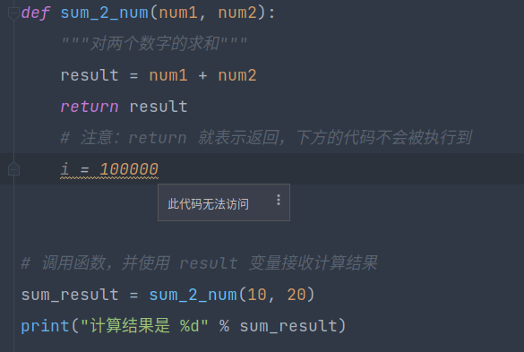 


### 10.9 函数的嵌套调用

* 一个函数里面 **又调用** 了 **另外一个函数**，这就是 **函数嵌套调用**
* 如果函数 `test2` 中，调用了另外一个函数 `test1`
  * 那么执行到调用 `test1` 函数时，会先把函数 `test1` 中的任务都执行完
  * 才会回到 `test2` 中调用函数 `test1` 的位置，继续执行后续的代码

```python
def test1():

    print("*" * 50)
    print("test 1")
    print("*" * 50)


def test2():

    print("-" * 50)
    print("test 2")
    
    test1()
    
    print("-" * 50)

test2()

```


#### 函数嵌套的演练 —— 打印分隔线

> 体会一下工作中 **需求是多变** 的

**需求 1**

* 定义一个 `print_line` 函数能够打印 `*` 组成的 **一条分隔线**

```python
def print_line(char):

    print("*" * 50)

```


**需求 2**

* 定义一个函数能够打印 **由任意字符组成** 的分隔线

```python
def print_line(char):

    print(char * 50)
    
```


**需求 3**

* 定义一个函数能够打印 **任意重复次数** 的分隔线

```python
def print_line(char, times):
    
    print(char * times)

```


**需求 4**

* 定义一个函数能够打印 **5 行** 的分隔线，分隔线要求符合**需求 3**

> 提示：工作中针对需求的变化，应该冷静思考，**不要轻易修改之前已经完成的，能够正常执行的函数**！

```python
def print_line(char, times):
    print(char * times)


def mulit_print():
    i = 0
    while i < 5:
        print_line("*", 20)
        i += 1


mulit_print()

```


改进：`变成可变的，可自定义字符、行数、每行的长度`

~~~python
def print_line(char, times):
    print(char * times)


def mulit_print(char, times, length):
    i = 0
    while i < times:
        print_line(char, length)
        i += 1


mulit_print("&", 5, 10)

~~~


<font size="5rem">文档注释扩展篇</font>

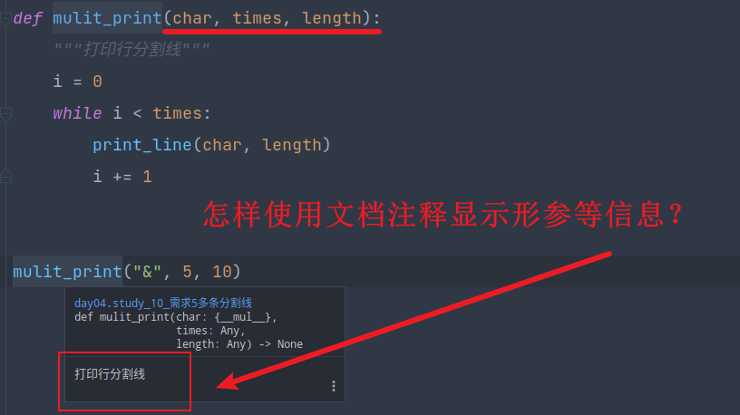 


1. 光标定位到你需要插入文档注释的位置
2. 点击小灯泡，选择 ==插入 doc string 存根==

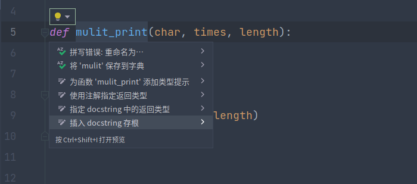 


结果就如同下方显示的那样

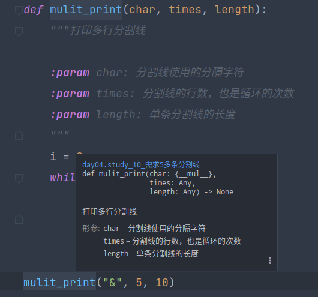 
